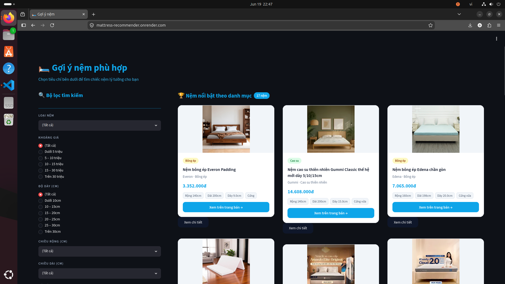

# 🛏️ Mattress Recommender System (Hệ thống gợi ý giường nệm)


**🌐 Live Demo trải nghiệm trực tiếp:** [https://mattress-recommender.onrender.com](https://mattress-recommender.onrender.com)

## 📖 1. Giới thiệu dự án
Trong bối cảnh thương mại điện tử phát triển, người dùng mua sắm nội thất (đặc biệt là giường nệm) thường gặp khó khăn do **dữ liệu bị phân mảnh** trên nhiều trang web khác nhau và thiếu tính chuẩn hóa. Thêm vào đó, các công cụ tìm kiếm hiện tại chủ yếu sử dụng "bộ lọc cứng" (hard-filter), thiếu linh hoạt và dễ dẫn đến việc trả về 0 kết quả nếu người dùng thiết lập tiêu chí quá khắt khe.

<div align="center">
  
</div>

**Mattress Recommender System** là một giải pháp toàn diện nhằm giải quyết các vấn đề trên. Dự án xây dựng một *data pipeline* hoàn chỉnh: từ tự động thu thập dữ liệu (crawling) trên nhiều nền tảng, tiền xử lý, chuẩn hóa, đến việc trích xuất đặc trưng và xây dựng một **hệ thống gợi ý thông minh (Soft-match)**. Hệ thống giúp hợp nhất dữ liệu và gợi ý các sản phẩm tương tự hoặc thay thế dựa trên nhu cầu thực tế của người dùng.

## 🚀 2. Các tính năng chính (Key Features)
* **Automated Data Crawling:** Tự động thu thập và cập nhật dữ liệu nệm từ các trang web lớn như: *Vua Nệm, Thế Giới Nệm, Kho Nệm Tổng Hợp, Thế Giới Giường Nệm*.
* **Data Cleaning & Standardization:** Xử lý dữ liệu nhiễu, điền khuyết giá trị (missing values) và chuẩn hóa các thuộc tính không đồng nhất (giá, chất liệu, độ cứng,...).
* **Feature Engineering:** Xử lý văn bản mô tả bằng TF-IDF Vectorizer. Mã hóa các biến phân loại (One-Hot, Ordinal Encoding) và chuẩn hóa dữ liệu số (Scaling).
* **Content-Based Recommendation:** Gợi ý sản phẩm có độ tương đồng cao dựa trên các đặc trưng kết hợp (đặc trưng số và văn bản).
* **Interactive Data Visualization:** Cung cấp các biểu đồ phân tích sâu (EDA) về phân phối giá, thương hiệu, chất liệu và ma trận tương quan.
* **Giao diện Web trực quan (Web App):** Xây dựng và triển khai một trang web tương tác, cho phép người dùng trực tiếp tìm kiếm, lọc và nhận kết quả gợi ý sản phẩm một cách nhanh chóng.

## 🛠️ 3. Công nghệ sử dụng (Tech Stack)
* **Ngôn ngữ:** Python
* **Thu thập dữ liệu:** `BeautifulSoup`, `Requests`, `Selenium`
* **Xử lý & Học máy:** `Pandas`, `NumPy`, `Scikit-learn`
* **Trực quan hóa:** `Matplotlib`, `Seaborn`
* **Giao diện Web (Frontend):** `Streamlit`
* **Môi trường & Triển khai:** `Docker`, `Jupyter Notebook`, `render`

## 📂 4. Cấu trúc thư mục (Project Structure)

```text
mattress-recommender/
├── crawlers/                 # Các kịch bản thu thập dữ liệu (Python scripts)
│   ├── crawl_khonemtonghop.py
│   ├── crawl_thegioigiuongnem.py
│   ├── crawl_thegioinem.py
│   └── crawl_vuanem.py
├── data/                     # Lưu trữ dữ liệu qua từng giai đoạn xử lý
│   ├── raw/                  # Dữ liệu gốc thu thập từ web (.json)
│   ├── processed/            # Dữ liệu đã qua làm sạch bước 1 (.csv)
│   └── final/                # Ma trận đặc trưng & dữ liệu sạch cuối cùng (.npz, .csv)
├── models/                   # Models & Encoders đã được huấn luyện
│   ├── oe_firmness.pkl       # Model mã hóa thứ bậc (độ cứng)
│   ├── ohc_brand.pkl         # Model mã hóa one-hot (thương hiệu)
│   ├── scaler.pkl            # Model chuẩn hóa dữ liệu số
│   ├── tfidf_desc.pkl        # Model vector hóa mô tả (TF-IDF)
│   └── tfidf_mat.pkl         # Ma trận TF-IDF
├── notebooks/                # Môi trường phân tích & thử nghiệm
│   ├── cleaning.ipynb
│   ├── eda.ipynb
│   └── preprocessing.ipynb
├── output/                   # Kết quả trực quan hóa dữ liệu (EDA)
├── rcm_sys/                  # Mã nguồn chính của Hệ thống gợi ý
│   ├── app.py                # File thực thi giao diện Streamlit
│   └── rcm_sys.py            # Lõi logic của hệ thống gợi ý
├── src/                      # Các module xử lý lõi (Core modules)
│   ├── cleaning.py           # Logic làm sạch dữ liệu
│   ├── data_loader.py        # Hàm hỗ trợ tải dữ liệu
│   └── preprocessing.py      # Logic tiền xử lý và trích xuất đặc trưng
├── .dockerignore             # Cấu hình bỏ qua file khi build Docker
├── .gitignore                # Cấu hình bỏ qua file rác khi push Git
├── codebook.csv              # Từ điển dữ liệu giải thích ý nghĩa các cột
├── demo.png                  # Ảnh chụp giao diện Web thực tế
├── Dockerfile                # File cấu hình đóng gói ứng dụng
├── README.md                 # Tài liệu mô tả dự án
└── requirements.txt          # Danh sách các thư viện phụ thuộc
```

## ⚙️ 5. Hướng dẫn Cài đặt & Triển khai (Installation & Deployment)

Dự án hỗ trợ hai phương pháp khởi chạy: sử dụng Docker thông qua Docker Hub (Phương pháp khuyên dùng, không cần source code) hoặc chạy thủ công bằng môi trường ảo từ source code.

### 🐳 Phương pháp 1: Khởi chạy nhanh qua Docker Hub (Khuyến nghị)
Yêu cầu hệ thống đã cài đặt sẵn Docker. Phương pháp này không yêu cầu bạn phải có mã nguồn hay cài đặt Python nội bộ, và hoạt động trơn tru trên cả Windows, macOS, hay Linux.

Chỉ cần mở Terminal/Command Prompt và chạy duy nhất lệnh sau:
```bash
docker run -p 8501:8501 nguyennhobaohuy/mattress-recommender
```
*(Docker sẽ tự động pull image về và khởi chạy. Sau khi tiến trình hoàn tất, truy cập `http://localhost:8501` trên trình duyệt để sử dụng ứng dụng).*

---

### 💻 Phương pháp 2: Cài đặt thủ công từ Source Code (Local Environment)
Nếu muốn xem source code và chạy trực tiếp, yêu cầu hệ thống cài đặt sẵn Python 3.8+.

**Bước 1:** Giải nén source code hoặc clone repository, sau đó mở Terminal tại thư mục gốc của dự án.
**Bước 2:** Tạo và kích hoạt môi trường ảo:
* **Trên Windows:**
  ```cmd
  python -m venv venv
  venv\Scripts\activate
  ```
* **Trên macOS/Ubuntu (Linux):**
  ```bash
  python3 -m venv venv
  source venv/bin/activate
  ```

**Bước 3:** Cài đặt các thư viện phụ thuộc:
```bash
pip install -r requirements.txt
```

**Bước 4:** Khởi chạy giao diện Web với Streamlit:
Trỏ Terminal về thư mục gốc của dự án (mattress-recommender) và chạy lệnh:
```bash
streamlit run rcm_sys/app.py
```

## 🧠 6. Phương pháp luận (Methodology)
* **Xây dựng Data Pipeline:** Dữ liệu thô từ các nguồn khác nhau được thu thập, gộp lại và đưa qua quy trình làm sạch (ETL process) để loại bỏ nhiễu và xử lý giá trị thiếu.
* **Feature Representation:**
  * Thuộc tính phân loại hạng mục (Categorical data) được xử lý bằng `OneHotEncoder` và `OrdinalEncoder`.
  * Văn bản mô tả sản phẩm (Text data) được biểu diễn thành các vector sử dụng `TfidfVectorizer`.
* **Similarity Computation:** Cốt lõi của hệ thống sử dụng phương pháp **Content-based Filtering**. Bằng cách tính toán độ tương đồng Cosine (Cosine Similarity) trên không gian vector đặc trưng đa chiều, hệ thống có thể trích xuất và gợi ý Top-K sản phẩm phù hợp nhất với ngữ cảnh của người dùng.

## 👨‍💻 7. Tác giả (Contributors)
* **Nguyễn Nho Bảo Huy** - GitHub: [@nnbhuy-dev](https://github.com/nnbhuy-dev)
* **Bùi Đức Gia Huy** - GitHub: [@HuyyGiaa](https://github.com/HuyyGiaa)
